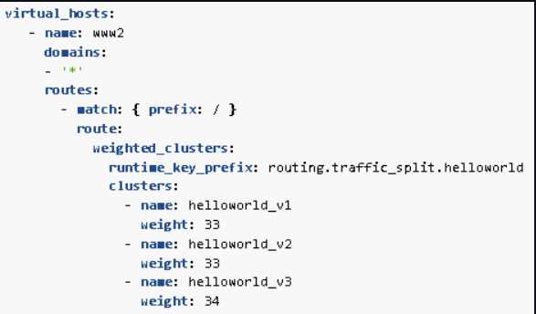

# Assignment 3 - Instructions

Please make sure that your are following the general instructions of this workshop! - https://github.com/sebivenlo/esd-2024-envoy/blob/main/Workshop%20materials/Demo/Assignments/READ.md

Link to Envoy's documentation about Traffic Shifting/Splitting - 
https://www.envoyproxy.io/docs/envoy/latest/configuration/http/http_conn_man/traffic_splitting

### Steps

Example of Multivariate testing



#### Step 1
Specify the socket adreess values as well as the values of the routing weight.

Example structure which needs to be followed:
```yaml
              - endpoint:
                  address:
                    socket_address: { address: ADDRESS, port_value: PORT_VALUE }
                load_balancing_weight: { value: VALUE }
```

#### Step 2
Change the values to the appropriate ones

#### HINT
This is the full code snippet that is missing, of course with dummy values, all of the values in all capital letters needs to be changed to the appropriate ones!

```yaml
              - endpoint:
                  address:
                    socket_address: { address: ADDRESS, port_value: PORT_VALUE }
                load_balancing_weight: { value: VALUE }
              - endpoint:
                  address:
                    socket_address: { address: ADDRESS, port_value: PORT_VALUE }
                load_balancing_weight: { value: VALUE }
              - endpoint:
                  address:
                    socket_address: { address: ADDRESS, port_value: PORT_VALUE }
                load_balancing_weight: { value: VALUE }
```

The sum of the weight values needs to be equal to one hundred, that is the default value by Envoy.